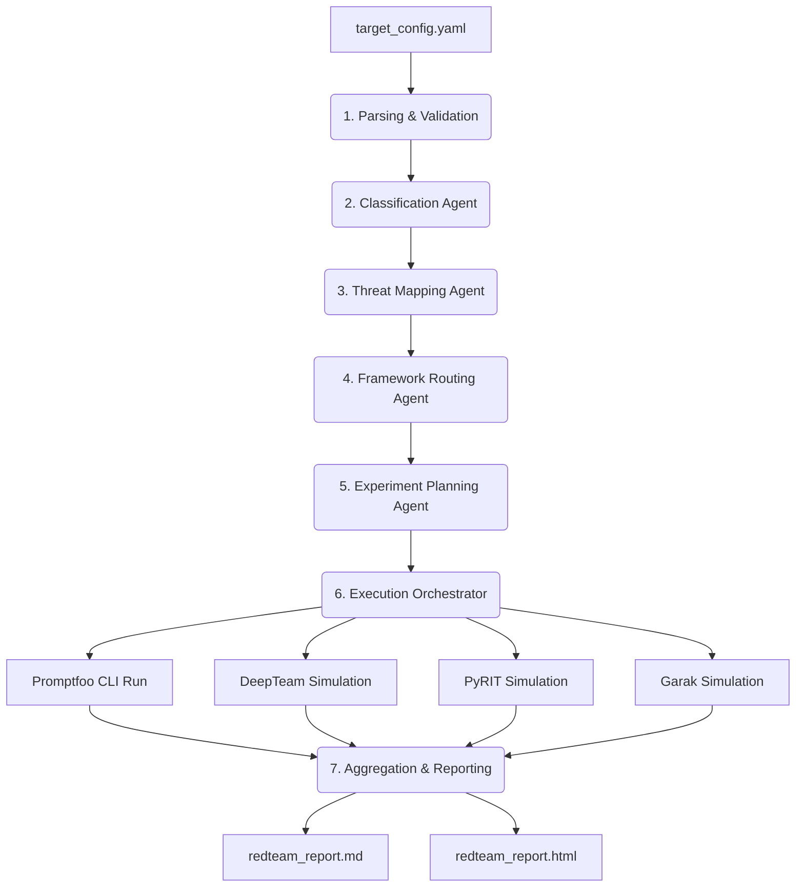

# LLM Multi-Agent Red Team Orchestrator

An automated, sequential multi-agent system designed to perform security audits, vulnerability scans, and adversarial testing on LLM-based applications.

By analyzing a target application's configuration, the orchestrator identifies potential security risks (aligned with **OWASP Top 10 for LLM Applications**), plans custom testing strategies, executes/simulates tests using industry-standard frameworks, and generates unified compliance/vulnerability reports.

---

## 🛠️ How It Works (Agent Pipeline)

The orchestrator utilizes **Gemini 2.5 Flash** to drive a sequence of specialized security agents:



1. **Parsing & Validation**: Reads the target application's properties from a standardized `target_config.yaml` file.
2. **Classification Agent**: Analyzes the architecture (e.g., RAG, simple chatbot, autonomous agent) to determine the logical structure of the target application.
3. **Threat Mapping Agent**: Maps the classification profile to known vulnerability vectors (such as Prompt Injection, Sensitive Data Leakage, System Instructions Bypass, or SQL Injection).
4. **Framework Routing Agent**: Selects the optimal framework (`promptfoo`, `deepteam`, `pyrit`, or `garak`) for each threat vector.
5. **Experiment Planning Agent**: Automatically generates configuration files (such as `promptfoo_config_gen.yaml`) and maps programmatic parameter payloads.
6. **Execution Orchestrator**: Triggers promptfoo evaluations via the CLI, interfaces with custom providers (`target_provider.py`), and executes simulated red-teaming sweeps.
7. **Aggregation & Reporting**: Combines findings from all runs and generates clean, human-readable reports in Markdown (`redteam_report.md`) and rich HTML (`redteam_report.html`).

---

## 📂 Repository Structure

* 📓 **`red_teaming_orchestrator_v2.ipynb`**: The main notebook containing the full pipeline, from agent declarations to CLI orchestration and report generation.
* ⚙️ **`target_config.yaml`**: Configuration file defining the target app's name, capabilities, and system instructions.
* 🐍 **`target_provider.py`**: Promptfoo-compatible custom Python hook routing adversarial prompts to the target application.
* 🏢 **`Rag_Application/`**: A sample Retrieval-Augmented Generation chatbot utilizing SQLite database lookup and Gemini/Gemma models.
* 📊 **`redteam_output/`**: Directory where generated configurations and run results are stored.

---

## 🚀 Getting Started

### 1. Prerequisites
Make sure you have Node.js (for running `promptfoo`) and Python 3.8+ installed.

### 2. Install Dependencies
Run the following in your terminal to set up dependencies:
```bash
pip install -r requirements.txt
# OR if using uv:
uv pip install -r pyproject.toml
```

### 3. Environment Variables
Create a `.env` file in the root directory and add your Google API Key:
```env
GOOGLE_API_KEY=your_gemini_api_key_here
```

### 4. Run the Orchestrator
Open and execute the main Jupyter notebook:
```bash
jupyter notebook red_teaming_orchestrator_v2.ipynb
```
Follow the notebook steps sequentially to trigger the multi-agent planning and view your security report.

---

## ⚖️ Rate-Limit & Budget Friendly
To safely execute on the **Gemini API Free Tier (15 RPM / 1,500 RPD)**, this orchestrator implements:
* **Exponential Backoff**: Automatic retries on rate-limit warnings (`429`).
* **Sequential Execution**: Strict concurrency control (`maxConcurrency: 1`).
* **Targeted Tests**: Small, focused adversarial test suites (3-5 assertions per vulnerability category).
